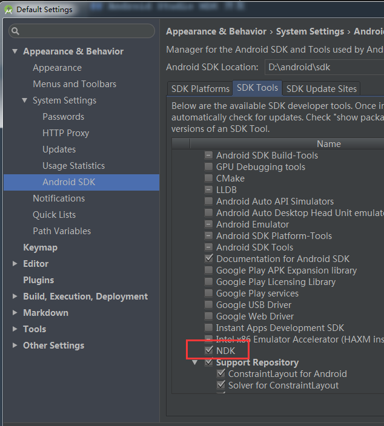
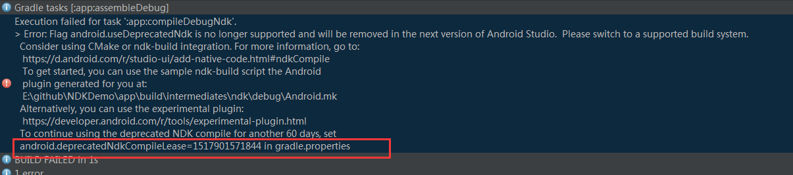

## Android Studio NDK 开发

### 环境
* Android Studio 3.0
* classpath 'com.android.tools.build:gradle:3.0.0'
* gradle-4.1-all.zip

### 步骤
1. 新建项目，下载 NDK

2. 创建 JNIUtil 类，编写方法
3. Build -> Make Project 生成 class 文件，在 JNIUtil.class 父目录调用命令 `javah com.hongfans.ndkdemo.JNIUtil`，生成文件 `com_hongfans_ndkdemo_JNIUtil.h`
    比如：在 app\build\intermediates\classes\debug\com\hongfans\ndkdemo\JNIUtil.class 存在文件，在 app\build\intermediates\classes\debug\ 打开 cmd 命令，然后执行 javah com.hongfans.ndkdemo.JNIUtil， 会在当前目录生成 com_hongfans_ndkdemo_JNIUtil.h
4. 在 main 目录下创建 目录 jni，拷贝生成的 `com_hongfans_ndkdemo_JNIUtil.h` 至。
5. 在 jni/ 下使用 C/C++ 实现 h 文件中的方法。
6. 在 module build.gradle 添加
```gradle
defaultConfig {

        ndk {
            moduleName "JNISample"
//            ldLibs "log", "z", "m"
            abiFilters "armeabi", "armeabi-v7a", "x86" // 指定生成对应平台的 so
        }
    }
```
7. 编译，生成 so 文件 `app\build\intermediates\ndk\debug\lib`
8. 在需要调用处调用 JNIUtil 中定义的方法

### 注意
1. local.properties 需要配置
```
ndk.dir=D\:\\android\\sdk\\ndk-bundle
sdk.dir=D\:\\android\\sdk
```

2. Error: Your project contains C++ files but it is not using a supported native build system.
在 `gradle.properties` 添加一行
```android.useDeprecatedNdk=true```
如果还报错

添加红框中的内容至 `gradle.properties`

### 参考资料
* [AndroidStudio最详细JNI教程](https://www.jianshu.com/p/81a97a43c176)

* [Android NDK Gradle3.0 以上最新生成.so之旅](http://blog.csdn.net/xiaozhu0922/article/details/78835144)


